# Logistics Analytics Star Schema (ERD)

This repository contains a **conformed-dimensional star schema** for a logistics analytics platform, including shared dimensions (Date, Drivers, Customers, Facilities, Routes, Trailers, Trucks) and multiple operational fact tables (Trips, Delivery Events, Fuel Purchases, Maintenance, Safety Incidents, Loads, plus monthly aggregates).

✅ The ER diagram below is written in **Mermaid** and will render automatically on GitHub.

---

## Entity-Relationship Diagram (Mermaid)

> **Note:** Mermaid `erDiagram` does **not** support inline comments inside attribute lines, so all comments are kept on their own lines to ensure GitHub renders successfully.

```mermaid
erDiagram
  %% =======================
  %% Dimensions (conformed)
  %% =======================

  DIM_DATE {
    int date_sk PK
    date full_date
    int year
    int quarter
    int month
    int day
    int week_of_year
    string month_name
    string day_name
  }

  DIM_DRIVERS {
    int driver_sk PK
    string driver_id UK
    string first_name
    string last_name
    date hire_date
    date termination_date
    string license_number
    string license_state
    date date_of_birth
    string home_terminal
    string employment_status
    string cdl_class
    int years_experience
    datetime2 effective_from
    datetime2 effective_to
    bool is_current
  }

  DIM_CUSTOMERS {
    int customer_sk PK
    string customer_id UK
    string customer_name
    string customer_type
    int credit_terms_days
    string primary_freight_type
    string account_status
    date contract_start_date
    decimal annual_revenue_potential
  }

  DIM_FACILITIES {
    int facility_sk PK
    string facility_id UK
    string facility_name
    string facility_type
    string city
    string state
    decimal latitude
    decimal longitude
    int dock_doors
    string operating_hours
    string home_terminal
  }

  DIM_ROUTES {
    int route_sk PK
    string route_id UK
    string origin_city
    string origin_state
    string destination_city
    string destination_state
    int typical_distance_miles
    decimal base_rate_per_mile
    decimal fuel_surcharge_rate
    int typical_transit_days
  }

  DIM_TRAILERS {
    int trailer_sk PK
    string trailer_id UK
    string trailer_number
    string trailer_type
    int length_feet
    int model_year
    string vin
    date acquisition_date
    string status
    string current_location
  }

  DIM_TRUCKS {
    int truck_sk PK
    string truck_id UK
    string unit_number
    string make
    int model_year
    string vin
    date acquisition_date
    int acquisition_mileage
    string fuel_type
    int tank_capacity_gallons
    string status
    string home_terminal
  }

  %% =======================
  %% Facts
  %% =======================

  FACT_TRIPS {
    string trip_id PK
    int driver_sk FK
    int truck_sk FK
    int trailer_sk FK
    int customer_sk FK
    int route_sk FK
    int start_date_sk FK
    int end_date_sk FK
    string load_id
    decimal actual_distance_miles
    decimal actual_duration_hours
    decimal average_mpg
    string trip_status
  }

  FACT_DELIVERY_EVENTS {
    string event_id PK
    string trip_id
    int driver_sk FK
    int facility_sk FK
    int event_date_sk FK
    string event_type
    datetime2 scheduled_datetime
    datetime2 actual_datetime
    bool on_time_flag
    string location_city
    string location_state
    int detention_minutes
  }

  FACT_FUEL_PURCHASES {
    string fuel_purchase_id PK
    int driver_sk FK
    int truck_sk FK
    int trip_date_sk FK
    string trip_id
    decimal gallons
    decimal price_per_gallon
    decimal total_cost
    string fuel_card_number
    string location_city
    string location_state
  }

  FACT_MAINTENANCE {
    string maintenance_id PK
    int truck_sk FK
    int maintenance_date_sk FK
    string trip_id
    string maintenance_type
    int odometer_reading
    decimal labor_hours
    decimal labor_cost
    decimal parts_cost
    decimal total_cost
    string service_description
    string facility_location
  }

  FACT_SAFETY_INCIDENTS {
    string incident_id PK
    int driver_sk FK
    int truck_sk FK
    int incident_date_sk FK
    string trip_id
    string incident_type
    string location_city
    string location_state
    bool at_fault_flag
    bool injury_flag
    decimal vehicle_damage_cost
    decimal cargo_damage_cost
    decimal claim_amount
    bool preventable_flag
    string description
  }

  FACT_LOADS {
    string load_id PK
    int customer_sk FK
    int route_sk FK
    int load_date_sk FK
    string load_type
    int weight_lbs
    int pieces
    decimal revenue
    decimal fuel_surcharge
    decimal accessorial_charges
    datetime2 dispatch_date
    string booking_type
    string load_status
  }

  %% Monthly aggregate fact: business key resolved to SK during ETL
  FACT_DRIVER_MONTHLY_METRICS {
    string driver_id
    int driver_sk FK
    string month
    int trips_completed
    decimal total_miles
    decimal total_revenue
    decimal average_mpg
    decimal total_fuel_gallons
    decimal average_idle_hours
    decimal on_time_delivery_rate
  }

  %% Monthly aggregate fact: business key resolved to SK during ETL
  FACT_TRUCK_UTILIZATION {
    string truck_id
    int truck_sk FK
    string month
    int trips_completed
    decimal total_miles
    decimal total_revenue
    int maintenance_events
    decimal maintenance_cost
    decimal fuel_gallons_used
    decimal downtime_hours
    decimal utilization_rate
  }

  %% =======================
  %% Relationships
  %% =======================

  DIM_DATE ||--o{ FACT_TRIPS : start_date_sk
  DIM_DATE ||--o{ FACT_TRIPS : end_date_sk
  DIM_DATE ||--o{ FACT_DELIVERY_EVENTS : event_date_sk
  DIM_DATE ||--o{ FACT_FUEL_PURCHASES : trip_date_sk
  DIM_DATE ||--o{ FACT_MAINTENANCE : maintenance_date_sk
  DIM_DATE ||--o{ FACT_LOADS : load_date_sk
  DIM_DATE ||--o{ FACT_SAFETY_INCIDENTS : incident_date_sk

  DIM_DRIVERS ||--o{ FACT_TRIPS : driver_sk
  DIM_DRIVERS ||--o{ FACT_DELIVERY_EVENTS : driver_sk
  DIM_DRIVERS ||--o{ FACT_SAFETY_INCIDENTS : driver_sk
  DIM_DRIVERS ||--o{ FACT_DRIVER_MONTHLY_METRICS : driver_sk

  DIM_TRUCKS ||--o{ FACT_TRIPS : truck_sk
  DIM_TRUCKS ||--o{ FACT_FUEL_PURCHASES : truck_sk
  DIM_TRUCKS ||--o{ FACT_MAINTENANCE : truck_sk
  DIM_TRUCKS ||--o{ FACT_SAFETY_INCIDENTS : truck_sk
  DIM_TRUCKS ||--o{ FACT_TRUCK_UTILIZATION : truck_sk

  DIM_TRAILERS ||--o{ FACT_TRIPS : trailer_sk

  DIM_CUSTOMERS ||--o{ FACT_TRIPS : customer_sk
  DIM_CUSTOMERS ||--o{ FACT_LOADS : customer_sk

  DIM_ROUTES ||--o{ FACT_TRIPS : route_sk
  DIM_ROUTES ||--o{ FACT_LOADS : route_sk

  DIM_FACILITIES ||--o{ FACT_DELIVERY_EVENTS : facility_sk
```



---

## Modeling Notes

- **Conformed dimensions** are shared across facts to support consistent slicing (Driver, Truck, Customer, Route, Date, etc.).
- **Surrogate keys (SK)** are the primary join keys between dimensions and facts.
- **Business keys (UK)** are stored for lineage and ETL matching (e.g., `driver_id`, `truck_id`).
- `DIM_DRIVERS` is modeled as **SCD Type 2** via `effective_from`, `effective_to`, and `is_current`.

---

## Repo Structure

```text
.
├── StarSchema(ERD).md
├── sql/
│   ├── ddl_dimensions.sql
│   ├── ddl_facts.sql
│   └── views_semantic.sql
├── etl/
│   ├── staging/
│   └── transformations/
└── docs/
    └── data_dictionary.md
```

---

## How to Use

1. Copy this `StarSchema(ERD).md` into your GitHub repository root.
2. GitHub will automatically render the Mermaid ER diagram.
3. Optionally, add DDL scripts under `sql/` and a data dictionary under `docs/`.
